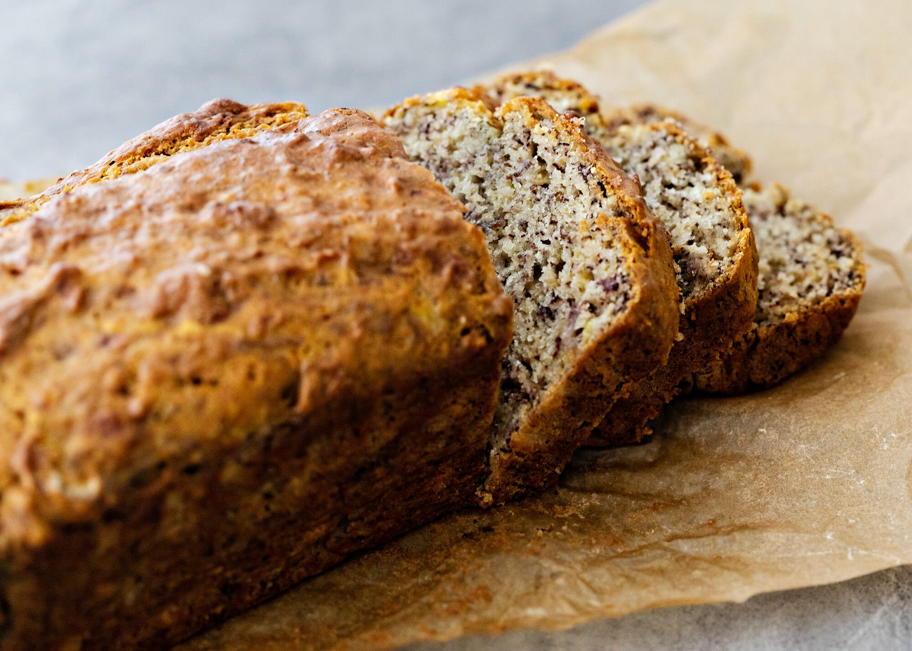

### Ingredients

- 2 cups gluten-free flour mix (Use Bob’s Redmill All Purpose GF baking flour)
- 1 cup of sugar
- 1 teaspoon baking powder
- 1 teaspoon baking soda
- 1/4 teaspoon salt
- 9 TBSP aquafaba (to replace eggs)
- 1/3 cup apple sauce
- 1 1/3 cup bananas (mashed; about 3 to 4 medium)
- 1/2 cup canola oil
- 1/2 cup almonds (sliced)

### Instructions
  
- Gather the ingredients.
- Preheat the oven to 350 F.
- Lightly oil a standard bread tray and set aside.
- Mix all ingredients in a large bowl.
- Bake for 18 to 20 minutes, or until the bread spring back slightly when touched.
- Allow bread to cool in the pan on a wire cooling rack for 30 minutes, then remove and allow bread to cool on the cooling rack.
- Serve warm, at room temperature, or cold.

