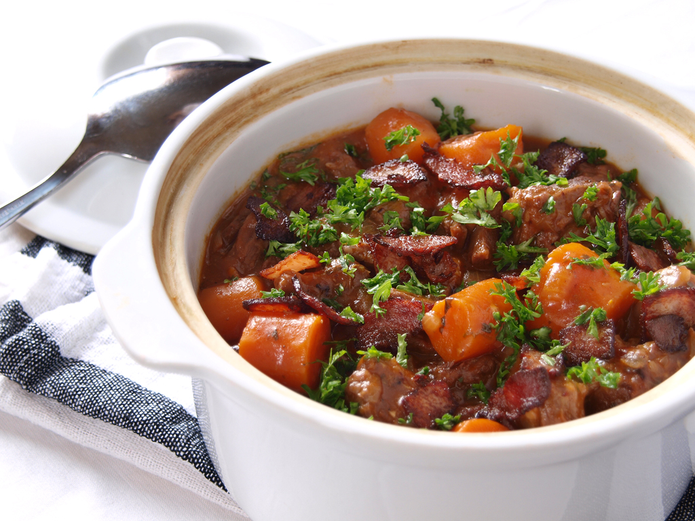

Prep Time: 30 minutes
Cook Time: Slow cooker - 8 hours on low
Yield: Serves 6

### Ingredients

- 1 1/2 lb beef chuck roast, trimmed of excess fat and sinew, cut in 3/4 inch chunks. (or 1 1/2 lb stew meat)
- 1 Tbsp GF floor
- 1 tsp unrefined sea salt
- 2 Tbsp soy sauce
- 1 bay leaf
- 1 tsp thyme or Italian seasoning
- 8 oz Bacon, chopped
- 4 medium carrots, scraped and chopped into 1/2-inch thick rounds
- 4 medium Russet or yukon gold potatoes, peeled and chopped into 1-inch cubes. (or 1.5 lb small potatoes cut in half)
- 1 cup pearl onions. (or 1 large onion, chopped in big chuncks)
- 1 yellow beet, diced
- 1 orange pepper, diced
- 1 1/2 cup mushrooms, diced
- 1 can diced tomatoes
- 2 quarts stock

### Instructions

- Mix the diced meat with the flour. Put in the slow cooker
- Put bacon in a pan and cook on medium-high for three to five minutes. Allow it to render its fat and brown a bit, drain the excess fat and then toss in the slow cooker
- Stir in the vegetables, seasoning, and add the stock last.
- Set the slow cooker on low for 8 hours.
