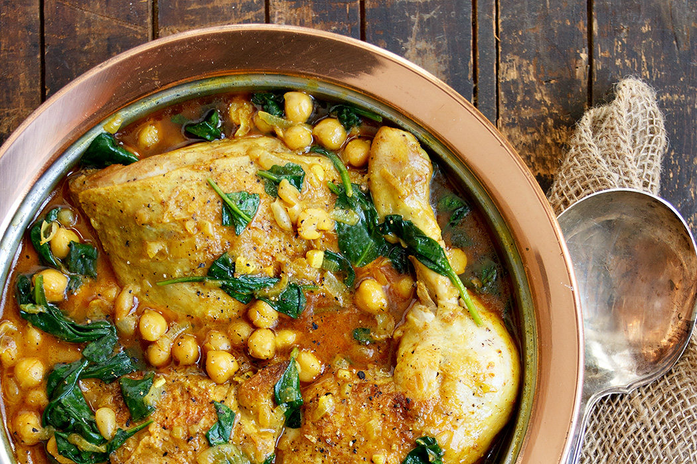

Serves: 6 people
Cooking time: 30mins

### Ingredients

- 1 to 1.5lb chicken breasts
- 24oz can diced tomatoes
- 14oz can of chickpeas
- 1 orange or red pepper
- 1 portobello mushroom
- 2 cups fresh spinach
- 1 medium onion
- ½ cup parsley
- ¼ cup lemon juice
- 1 Tbsp dried thyme
- 1-½ tsp salt
- 2 Tbsp oil

### Instructions

- Sauté chopped onion and pepper in oil in large and deep pan, medium heat.
- Add diced mushroom.
- While this is cooking, cut the chicken breasts in ½” pieces.
- Add to pan.
- Add half the salt + dried thyme.
- Sear chicken and stir until no raw parts are visible, 4-6 minutes.
- Add lemon juice.
- Add chickpeas.
- Add diced tomatoes.
- Wash spinach and add to pan, stirring it into the mix.
- Chop parsley and add to mix.
- Add rest of salt.
- Stir well, drop to low and let simmer for 5-10 more minutes.
