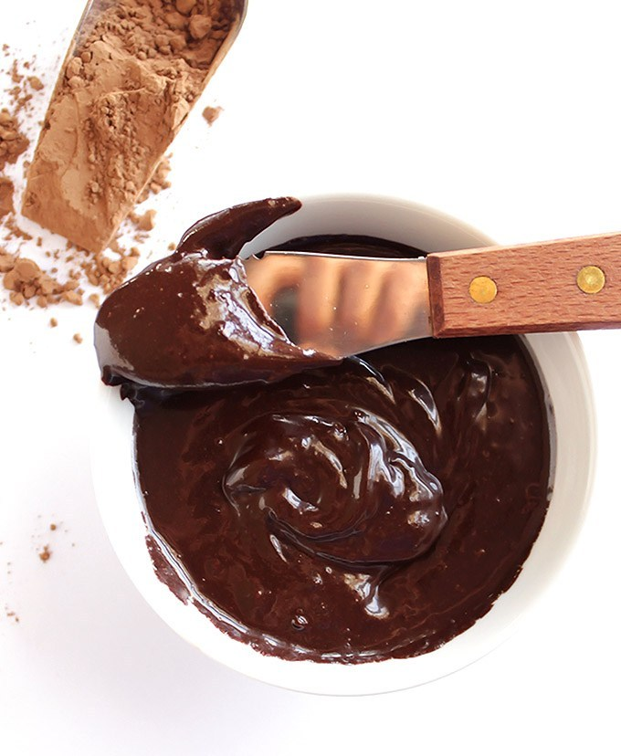

Great with King Arthur GF chocolate cake mix - sub 3 TBP chickpea water (“Aquafaba”) for every egg listed

### Ingredients

- 3/4 cup unsweetened cocoa powder, sifted if there are lumps
- 1/4 cup melted coconut oil
- 1/4 cup to 1/2 cup pure maple syrup (or honey for non vegans. However, I found maple syrup yields a better consistency)
- 1 teaspoon pure vanilla extract
- (optional) splash of unsweetened almond milk

### Instructions

- Add all ingredients to a small mixing bowl. Mix until everything comes together and you have a thick, rich frosting like consistency.
- Taste and adjust as needed, add a little more maple syrup/honey if not sweet enough or more cocoa powder if too runny.
- You can also stir in a splash of dairy free, unsweetened milk if you find the consistency to be too thick. A little goes a long way.
- Spread onto cooled cupcakes, cookies, cakes, or sweet breads immediately. Although the frosting does stay moist after frosted, I found it does kind of stiffen up and becomes harder to spread after a little while so use right away.

Original recipe: [Vegan Chocolate Frosting](https://robustrecipes.com/5-minute-vegan-chocolate-frosting/)
