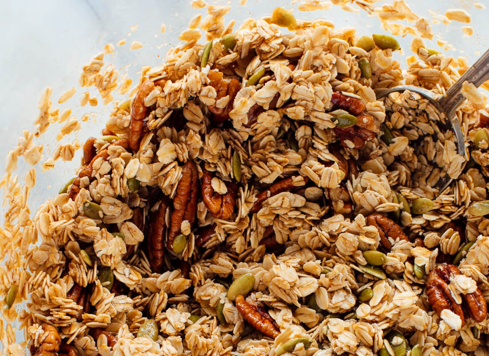

### Ingredients

- 4 cups rolled oats
- 1 cup raw sliced almonds
- ½ cup chopped pecans
- 1 tsp fine grained sea salt
- 1/2 tsp cinnamon (leave out for Nicole)
- 1/2 cup olive oil
- 1/2 cup maple syrup
- 3/4 tsp vanilla
- 1/2 cup coconut flakes 1/3 cup dried currants

### Instructions

- Preheat oven to 350 and line pan with aluminum foil
- In large mixing bowl combine oats, salt, nuts
- Stir in olive oil, maple syrup and vanilla
- Turn the granola out into a pan and spread out to an even layer
- Bake for 20 minutes
- Remove from oven and top with coconut flakes
- Mix in coconut ant stir up granola to make sure granola bakes evenly
- Return pant to oven for 10 more minute
- In the meantime, chop up ginger and cranberries if using (or get the currants)
- After 10 minutes are up, add the dried fruit and stir to combine
- Let granola cool before enjoying.
