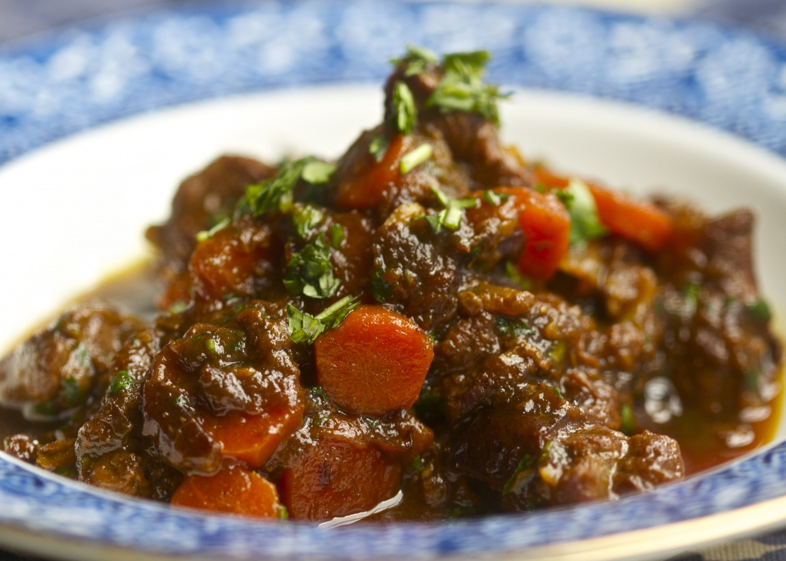

### Ingredients

- 9g Dang gui (Aka Tang Kui aka angelica sinesis radix)
- 15g Huang qi (AKA Astragalus)
- 48g mutton (or lamb)
- Any additional veggies (carrots, potatoes, celery)

### Instructions

- Simmer in 8 cups of water until it is reduced to 3 cups.
- Drink the liquid and eat the meat.
- Have daily for 1 -2 weeks.

(For a normal person, this recipe would include 15g fresh ginger. Only use the huang qi if she is sweating easily and very fatigued).
