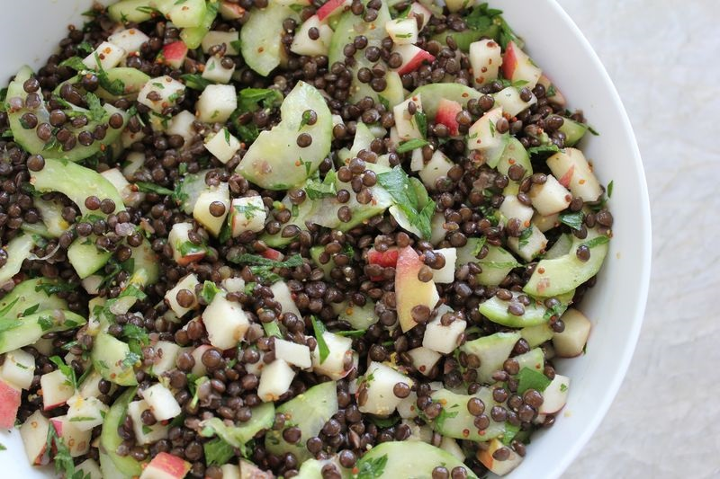

### Ingredients

- 1 cups French Green lentils
- 1 Tsp salt
- Olive oil
- Balsamic vinegar
- 4 cups water
- 1 apple, peeled and cut into 1 cm cubes
- 1 small onion, diced

### Instructions

- Bring 4 cups water + 1/2 tsp salt to a boil, add lentils and return to a boil. Then reduce to a simmer, partially covered, for 30 minutes until lentils are soft but not mushy.
- Add 1 Tbsp olive oil to a frying pan, and saute onions on medium heat until golden brown. Add apples and continue to saute until apples are soft but not mushy.
- Strain the lentils and return to pot. Add in apple/onion mixture, 4 TBSP olive oil and 1-3 TBSP balsamic vinegar, depending on taste. Salt to taste and enjoy!
- Pair with rice, a green salad or soup
