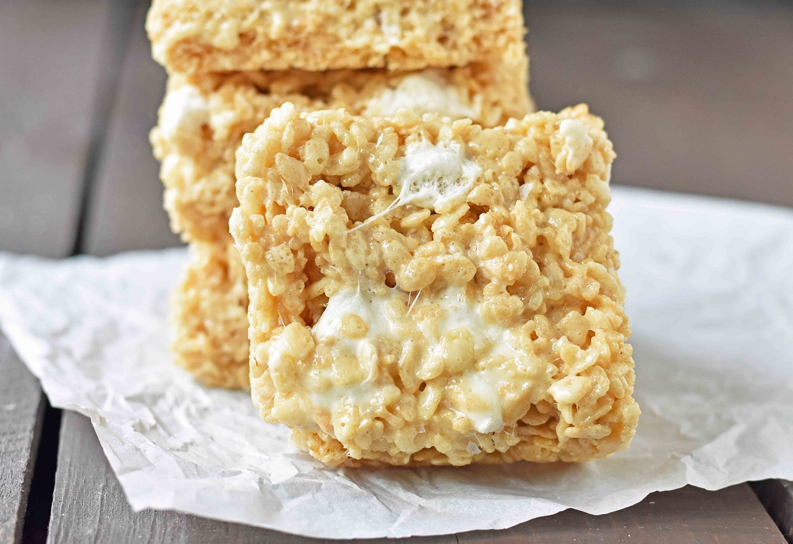

Makes one 9-inch square pan

### Ingredients

- 4 cups rice cereal
- 1/2 cup honey
- 1/2 cup Tahini (I like the Once Again Brand - with the Racoon on the label)
- 1/2 teaspoon sea salt

### Instructions

- Line a 9-inch square pan with parchment paper and set aside. In a small saucepan over medium heat, gently bring the honey to a boil and allow it to boil for one minute. Remove the boiled honey from the heat, then stir in the tahini and salt until smooth.
- Place the cereal in a large bowl, then pour the tahini and honey mixture over the top. Stir well, until all of the cereal is thoroughly coated.
- Press the mixture into the prepared pan, and press HARD to pack the bars tightly. Allow the bars to cool completely before slicing and serving– you can speed up the process by freezing them for about 30 minutes.
- Store in a sealed container in the fridge for best shelf life, and serve chilled or at room temperature.

Adapted from: http://detoxinista.com/2014/07/peanut-butter-honey-rice-krispie-treats/
