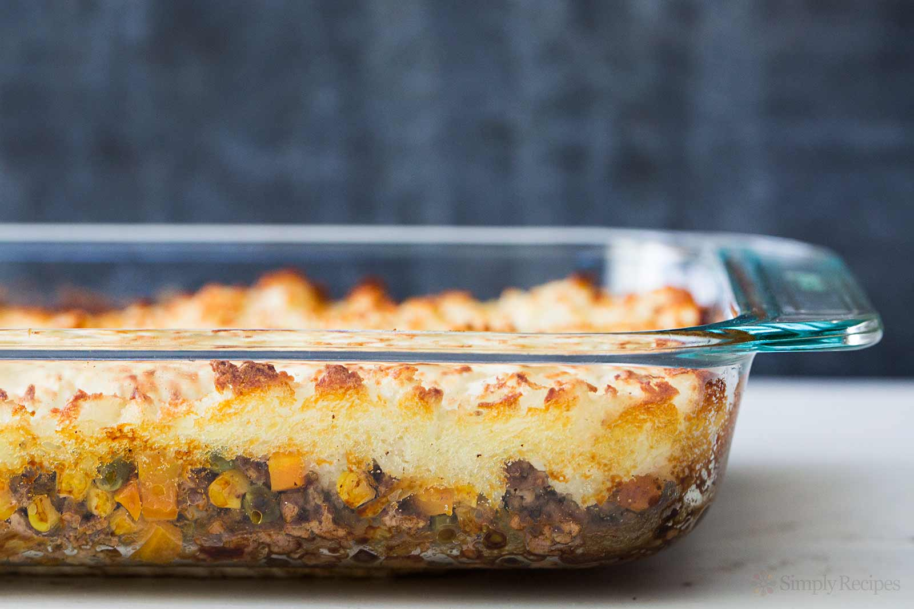

### Ingredients

For Meat Layer

- 2 tablespoons coconut oil or any other oil
- 1 large onion
- 2 cups chopped carrots
- 2 lbs ground beef
- 1/2 teaspoon thyme
- 1/4 teaspoon nutmeg (reduced from ½ in original recipe)
- 1 teaspoon salt
- 1 cup frozen peas
- 2 TBSP tomato paste

For Potato Layer

- 4 cups potatoes (4-5 lg sweet potatoes or 6 regular potatoes)
- 3 tablespoons olive oil (or other oil)
- 1/4 teaspoon nutmeg (reduced from 1tsp original recipe)
- 1/2 teaspoon salt

### Instructions

- Chop up potatoes and steam or boil them until fully soft.
- While the sweet potatoes are cooking, prepare the meat layer. Chop an onion and saute in oil until starting to brown.
- Chop up your carrots into very small piece and then add to the sauteing onions. Put on a medium heat, and cook, stirring occasionally, until the carrots are mostly soft.
- Add the ground beef to the carrots and onions, stirring often, and cook until you have fully cooked ground beef crumbles.
- Add in frozen peas.
- Add the thyme, nutmeg, and salt.
- Add the tomato paste and mix thoroughly.
- Put this meat layer in a flat layer at the bottom of a 9x13 baking dish.
- In a separate container, take the potatoes and remove their peels. Add oil and spices, and mash until uniform.
- Spread in a flat layer on top of the ground beef
- Bake for 30 minutes at 350, or until the sweet potato layer starts browning a bit.
