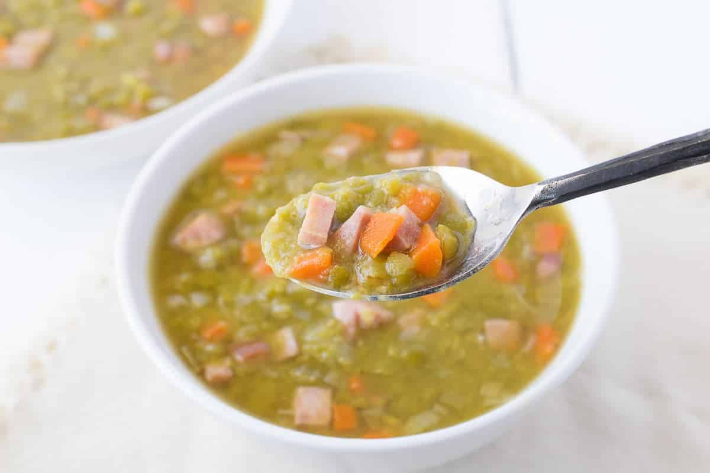

### Ingredients

- 2 tablespoons olive oil
- 1 large onion, chopped
- 1 cup chopped celery
- 1 cup chopped peeled carrots
- 1 1/2 pounds smoked pork hocks (or just a smoked ham from the meat section. Please check for additional ingredients. Normal celery salt, sugar ok). 
- 2 teaspoons dried leaf marjoram
- 1 1/2 cups green split peas
- 8 cups water

### Instructions

- Heat up olive oil in heavy large pot or Dutch oven over medium-high heat.
- Add onion, celery and carrots. Sauté until vegetables begin to soften, about 8 minutes.
- Add pork and marjoram; stir 1 minute.
- Add peas, then water, and bring to boil. Reduce heat to medium-low. Partially cover pot; simmer soup until pork and vegetables are tender peas are falling apart, stirring often, about 1 hour and 10 minutes.
- Transfer hocks to bowl. Puree 5 cups soup in batches in blender. Return to pot.
- Cut pork off bones. Dice pork; return pork to soup.
- Season with salt.

Can be made 1 day ahead. Refrigerate until cold, then cover. Rewarm before serving.
