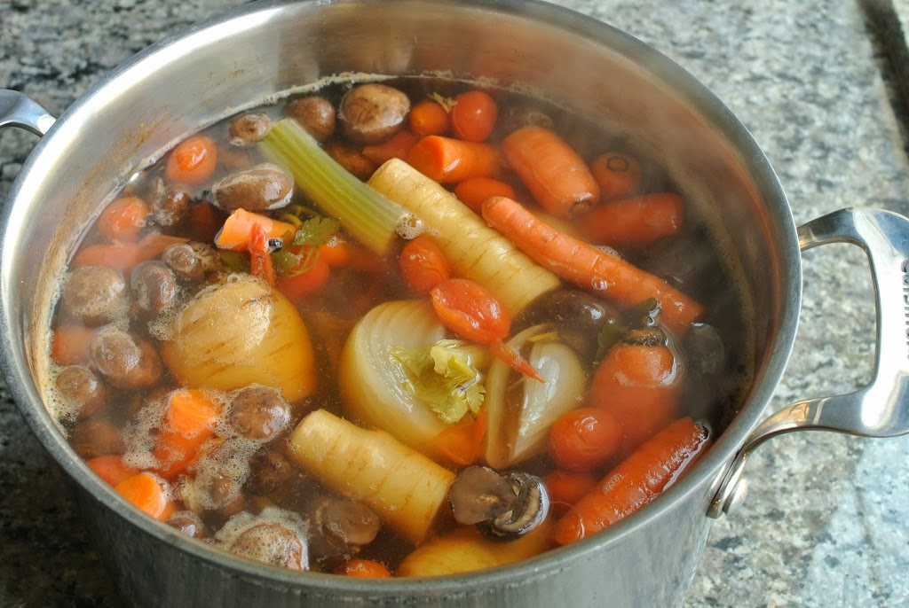

Cooking time: 50 min

### Ingredients  

- 1 tablespoon olive oil
- 1 large onion
- 2 stalks celery, including some leaves
- 2 large carrots
- ½ bunch green onions, chopped
- 8 sprigs fresh parsley
- 6 sprigs fresh thyme
- 2 bay leaves
- 1 teaspoon salt
- 2 quarts water  

### Instructions  

- Chop scrubbed vegetables into 1-inch chunks. Remember, the greater the surface area, the more quickly vegetables will yield their flavor.
- Heat oil in a soup pot. Add onion, celery, carrots, scallions, parsley, thyme, and bay leaves.
- Cook over high heat for 5 to 10 minutes, stirring frequently.
- Add salt and water and bring to a boil. Lower heat and simmer, uncovered, for 30 minutes.
- Strain. Discard vegetables.

Other ingredients to consider: mushrooms, eggplant, asparagus (butt ends), corn cobs, fennel (stalks and trimmings), bell peppers, pea pods, chard (stems and leaves), celery root parings, marjoram (stems and leaves), basil, potato parings . . .

Original recipe: http://allrecipes.com/recipe/12982/basic-vegetable-stock/
